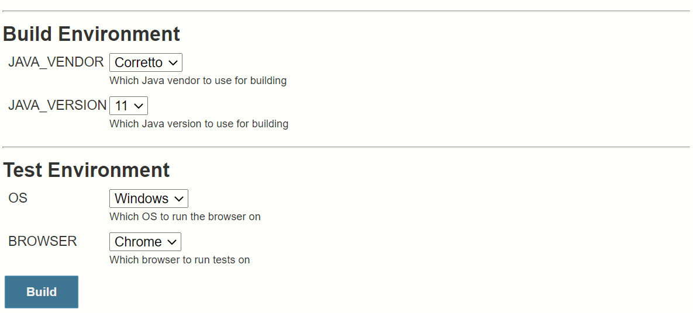
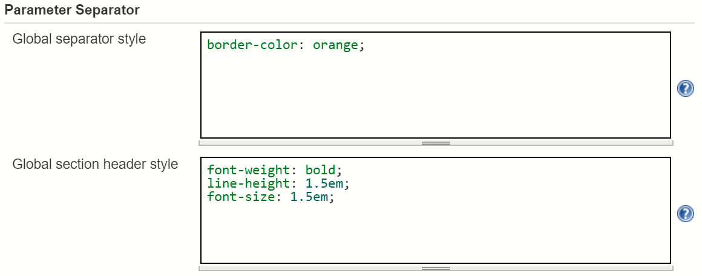
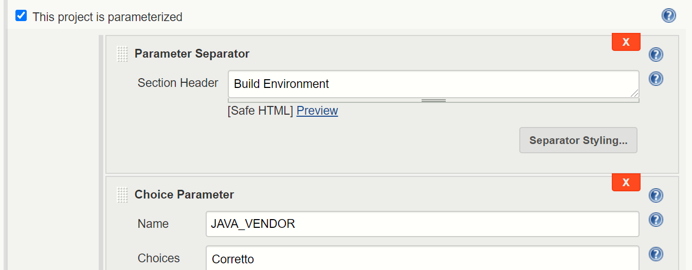
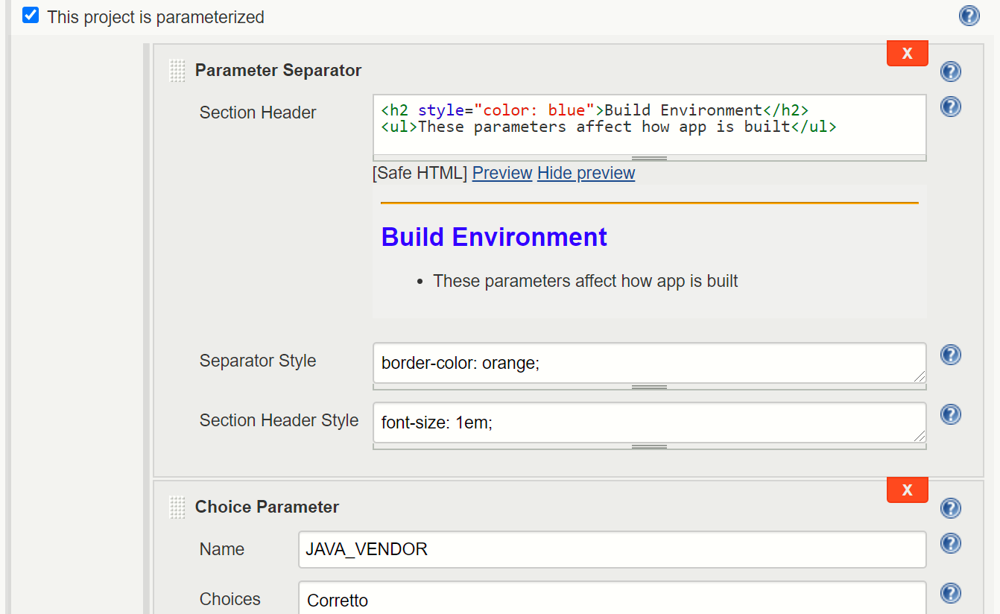
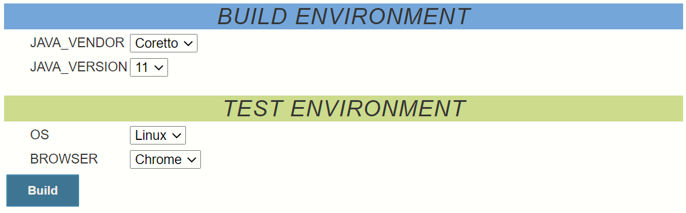
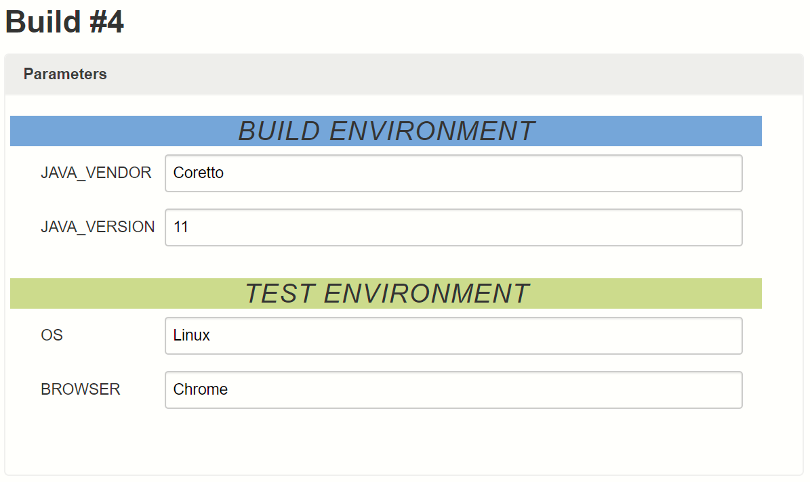
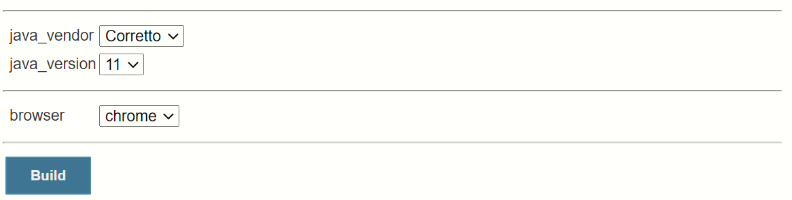

# Parameter Separator Plugin

[](https://ci.jenkins.io/job/Plugins/job/parameter-separator-plugin/job/master/)
[](https://plugins.jenkins.io/parameter-separator)
[](https://github.com/jenkinsci/parameter-separator-plugin/releases/latest)
[](https://plugins.jenkins.io/parameter-separator)

## Introduction

This is a simple plugin for Jenkins CI that allows one to clearly differentiate sets of parameters on a job build page.
This can be useful for jobs with lots of parameters.

Specifically, the plugin creates a stylizable separator that consists of &lt;hr /&gt; tag with an optional section header.
The styling of both the horizontal rule and the section header can be customized, both globally and for each individual separator.

### Example "Build with Parameters" page with separators



## Installing and configuring the plugin

Install this plugin from the Jenkins Update Center. Go to Manage Jenkins -> Plugin Manager -> Available tab. Search for
"Parameter Separator".

Configure default styling for your parameters in the Jenkins global configuration page. Go to Manage Jenkins -> Configure
System -> "Parameter Separator" section.



## Using the plugin in freestyle jobs

Go to you job Configure page and add any number of parameter separator elements:



Optionally you can use HTML, customize styles, and click Preview to see how it will look:



Now, go to you job's **Build with Parameters** page. You'll see you parameter groups nicely separated:



When your build is ready and you go to its **Parameters** section, you'll also see separators:



## Using in pipeline jobs

**Note:** It's recommended to provide an explicit name for each separator parameter, when using in pipeline.
Otherwise, it will be redefined under a new random name during each build, which can cause some minor issues.
For example, the "Job Configuration History" plugin will indicate that each has changed job configuration.

---

### Example usage in declarative pipeline

```groovy
pipeline {
	agent any
	parameters {
		separator(name: "building")
		choice(name: "java_vendor", choices: "Corretto")
		choice(name: "java_version", choices: "11")
		separator(name: "testing")
		choice(name: "browser", choices: "chrome")
		separator(name: "end")
	}
	stages {
		stage("Build") {
			steps {
				echo "Building using ${params.java_vendor}-${params.java_version}"
			}
		}
	}
}
```



---

### Example usage in scripted pipeline, with section headers
```groovy
properties([
	parameters([
		separator(name: "BUILD_ENVIRONMENT", sectionHeader: "Build Environment"),
		choice(name: "JAVA_VENDOR", choices: ["Coretto"]),
		choice(name: "JAVA_VERSION", choices: ["11"]),
		separator(name: "TEST_ENVIRONMENT", sectionHeader: "Test Environment"),
		choice(name: "OS", choices: ["Linux"]),
		choice(name: "BROWSER", choices: ["Chrome"])
	])
])
```


---

### Example usage in scripted pipeline, with advanced custom styling

```groovy
properties([
	parameters([
		separator(name: "BUILD_ENVIRONMENT", sectionHeader: "Build Environment",
			separatorStyle: "border-width: 0",
			sectionHeaderStyle: """
				background-color: #7ea6d3;
				text-align: center;
				padding: 4px;
				color: #343434;
				font-size: 22px;
				font-weight: normal;
				text-transform: uppercase;
				font-family: 'Orienta', sans-serif;
				letter-spacing: 1px;
				font-style: italic;
			"""
		),
		choice(name: "JAVA_VENDOR", choices: ["Coretto"]),
		choice(name: "JAVA_VERSION", choices: ["11"]),
		separator(name: "TEST_ENVIRONMENT", sectionHeader: "Test Environment",
			separatorStyle: "border-width: 0",
			sectionHeaderStyle: """
				background-color: #dbdb8e;
				text-align: center;
				padding: 4px;
				color: #343434;
				font-size: 22px;
				font-weight: normal;
				text-transform: uppercase;
				font-family: 'Orienta', sans-serif;
				letter-spacing: 1px;
				font-style: italic;
			"""
		),
		choice(name: "OS", choices: ["Linux"]),
		choice(name: "BROWSER", choices: ["Chrome"])
	])
])
```


