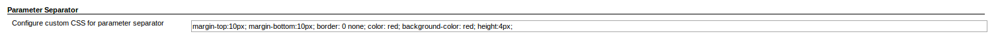
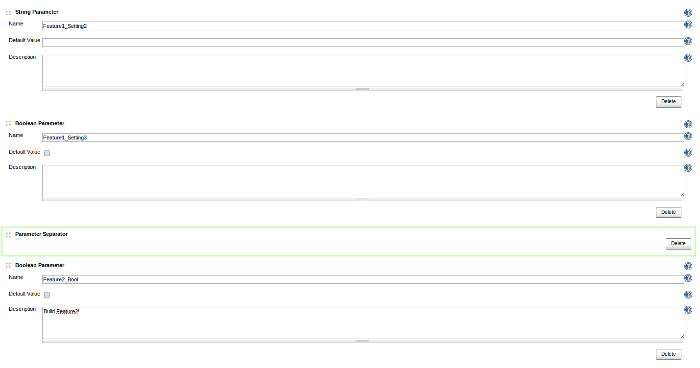
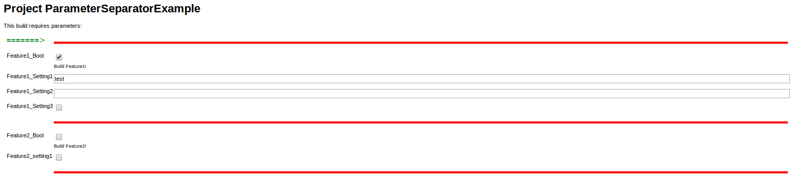

# PARAMETER SEPARATOR PLUGIN FOR JENKINS #

This is a dead simple parameter plugin for Jenkins CI that allows one to clearly differentiate sets of parameters on a jenkins build page. This can be useful for builds with lots of parameters (builds that dynamically build different items pased on the job parameters set at build time, for instance).

Specifically, the plugin creates an &lt;hr /&gt; tag with a globally configurable style attribute to better suit one's Jenkins install.

## How to use this plugin ###

1.  Install this plugin from the Jenkins Update Center
2.  Configure the styling for your parameters in the Jenkins global configuration page (Manage Jenkins -> Configure System; Parameter Separator section)

    

3.  Add any number of parameter separator elements to your parameterized job on the job's configuration page

    

4.  Now when you start a build of your job, you will have parameters clearly separated by your stylized separator!

    

## Using in pipeline jobs ###

**Note:** It's recommended to provide an explicit name for each separator parameter, when using in pipeline.
Otherwise, it will be redefined under a new random name during each build, which can cause some minor issues.
For example, the "Job Configuration History" plug-in will indicate that each has changed job configuration.

Example usage in scripted pipeline:

```groovy
node {
  properties([
    parameters([
      separator(name: "separator-main", sectionHeader: "Main Params"),
      string(name: "name"),
      separator(name: "Separator-other", sectionHeader: "Other Params"),
      booleanParam(name: "deploy")
    ])
  ])
}
```

Example usage in declarative pipeline:

```groovy
pipeline {
  agent any
  parameters {
    separator(name: "separator-main", sectionHeader: "Main Params", separatorStyle: "border-width: 0px", sectionHeaderStyle: "background-color: red")
    string(name: "name")
  }
  stages {
    stage("Build") {
      steps {
        echo "${params.name}"
      }
    }
  }
}
```
